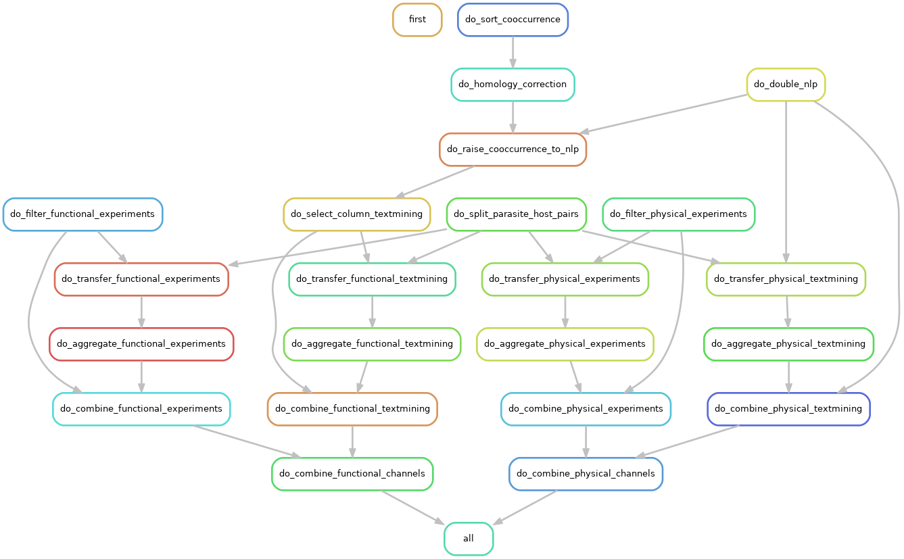

# Snakemake pipeline for processing of host-parasite PPIs scores

The pipeline lives on C2 at `/home/projects/ku_10024/people/henhol/paraSTRING/scripts/transfer_snakemake_pipeline/` and results can be found in `/home/projects/ku_10024/people/henhol/transfer-host-parasite/snakemake-transfer-results/`.

## Quick Start

This pipeline is run on Computerome 2 loading module anaconda3/4.4.0 which gives access to 
- Snakemake v.6.0.4
- Python v.3.6.10
- Pandas v.1.1.5

1. Define paths to input files and output directory in `config.yml`.
2. If on C2, run 
    ```
    qsub run_snakemake_transfer_c2.sh
    ```

## Description

### Steps (rules)



**Textmining**

1. Calculate homology score for all PPIs with direct cooccurrence score and apply homology correction  
    rules: `do_sort_cooccurrence`, `do_homology_correction`
1. Raise corrected direct cooccurrence scores to direct NLP Complex Portal calibrated scores to obtain direct functional textmining score  
    rules: `do_double_nlp`, `do_raise_cooccurrence_to_nlp`, `do_select_column_textmining`
1. Orthology transfer  
    rule: `do_split_parasite_host_pairs`
    1. Orthology transfer of direct functional textmining scores to obtain transferred functional textmining scores  
        rules: `do_transfer_functional_textmining`, `do_aggregate_functional_textmining`
    1. Orthology transfer of direct NLP score (= direct physical textmining score) scores to obtain transferred physical textmining scores  
        rules: `do_transfer_physical_textmining`, `do_aggregate_physical_textmining`
1. Combine direct and transferred evidence  
    For functional textmining, physical textmining, functional experiments and physical experiments
        rules: `do_combine_functional_textmining`, `do_combine_physical_textmining`, `do_combine_functional_experiments`, `do_combine_physical_experiments`

**Experiments**

1. Filter host-parasite PPIs from experiments scores to obtain direct functional and physical experiments scores  
    rules: `do_filter_experiments_functional`, `do_filter_experiments_physical`
1. Orthology transfer of direct functional and physical experiments scores to obtain transferred functional and physical experiments scores  
    rules: `do_transfer_functional_experiments`, `do_aggregate_functional_experiments`, `do_transfer_physical_experiments`, `do_aggregate_physical_experiments`

**Aggregation of channels**

1. Combine scores of textmining and experiments channels for both physical and functional PPIs. 
    rules: `do_combine_physical_channels`, `do_combine_functional_channels`

### Parameters / Input

The only parameters are the paths to the input files and where to store the results. 

- `cooccur_scores_path`: Cooccurrence scores of host-parasite PPIs (A-B and B-A) (KEGG calibrated)
- `simap_data_path`: Location of SIMAP all vs. all searches: Self normalized bitscores and reciprocal best hits in both directions
- `parasite_host_pairs_path`: Host parasite taxid pairs
- `nlp_scores_path`: Direct physical textmining score (only A-B) (from Katerina)
- `transfer_pairs_path`: Species pairs between which to transfer
- `experiments_physical_path`: path to inter-species pyysical experiments scores, not filtered for host-parasite PPIs yet (from Rebecca)
- `experiments_functional_path`: path to inter-species functional experiments scores, not filtered for host-parasite PPIs yet (from Rebecca)

Parameters are set in `config.yaml`.

### Output

- `host_parasite_functional.tsv`
- `host_parasite_physical.tsv`

## Results
(31.07.2022)

Number of PPIs. 

|            |             |      total |     >=0.15 |
|------------|-------------|-----------:|-----------:|
| functional | textmining  | 86,270,076 | 58,565,328 |
|            | experiments |      2,254 |      2,254 |
|            | combined    | 86,271,728 | 58,805,390 |
| physical   | textmining  |    725,188 |    560,074 |
|            | experiments |      2,254 |      2,254 |
|            | combined    |    727,080 |    562,682 |

## Updates

What to do in case the proteomes or species lists get updated. 

### SIMAP data

In case the list of host-parasite pairs or the proteomes are updated, the SIMAP data has to be updated and re-processed.  
Required SIMAP similarity scores:
- between all taxids between which PPIs are transferred 
- between all host-parasite pairs for the homology correction
- all species against themselves for calculating self-normalized bit scores

Thomas Rattei needs a tsv file with all those pairs.

For the pipeline a file is required that contains all the taxid pairs (not the species with themselves). 
So generate this first and then concatenate it with the list of species with themselves. 

```
cat <(cut -f2,3 transfer_species_pairs_levels.tsv | awk -F"\t" '$1>$2') \
  <(cat ../tagger-host-parasite/species.v11.0.eukaryotes.parasites.all_taxid_pairs.tsv | awk -F"\t" '$1>$2') \
  <(awk -F'\t' '{print $2"\t"$1}' ../tagger-host-parasite/species.v11.0.eukaryotes.parasites.all_taxid_pairs.tsv | awk -F"\t" '$1>$2') |\
   sort | uniq > taxid_pairs_simap.tsv
```

#### Returned data

The tar archive contains folders and files, on for each genome pair. The pairs are stored in the direction that was optimal for computing - sometimes a pair might thus be reversed in comparison to the list of pairs that you have sent me. But as all similarities within a pair are all-vs-all and are strictly symmetric, this is just a technical issue. Naming of the pairs is just; <genome1>/<genome1>.<genome2>, their format are tab separated values in gzip compression.

Each pair file is stored by these columns:  
Column 1: name protein 1  
Column 2: name protein 2  
Column 3: bitscore  
Column 4: percent identity of local alignment  
Column 5: percent similarity of local alignment  
Column 6: begin of local alignment in protein 1  
Column 7: end of local alignment in protein 1  
Column 8: begin of local alignment in protein 2  
Column 9: end of local alignment in protein 2


#### Download data

Download and unpack SIMAP data from Thomas in `simap-data/` with `qsub-download-simap.sh`, compared md5 using `md5sum` command.
Description of the data and columns is in a README.md in that folder.
All results based on SIMAP go into `simap-processed/`.

#### Parallelize

I tried to write a Snakemake pipeline for this but couldn't get the wildcards right. 

Make splits in `simap-processed/simap-pairs-splits/` with

```
split -l110  <(shuf taxid_pairs_simap.tsv) taxid_pairs_simap.split --additional-suffix=.tsv -da 4
```

#### Self-normalized bit scores

Calculate self-normalized bitscores with `calculate_self_normalized_bit_score_simap.py` for all pairs with `qsub-selfnorm-bitscores-simap.sh` and `selfnorm_bitscores_splits_simap.sh`. Those scripts are in the scripts folder of the paraSTRING repo.  
This script creates output files in both directions.  
Results go into `simap-processed/selfnorm-bitscores/`.  
Files are called `{taxid1}.{taxid2}_selfnorm_bitscore.tsv.gz`.  
Columns: qseqid, sseqid, self-norm bitscore, percident, percsim, qstart, qend, sstart, send.  

Scores are capped at 1 and hits whose self-hit is below the bitscore cutoff of 50 are set to 1i within the python script.

#### RBH

We need RBH between hosts for orthology transfer of inter-species interactions.  
We don't need RBH between hosts and parasites as of now since we don't transfer intra-species interactions.

`qsub-rbh-split-simap.sh` calls `find_rbh_splits_simap.sh` calls `find_rbh_from_norm_bitscores_simap.py` on 40 sets of pairs.
Results are in `simap-processed/rbh/` as `{taxid1}.{taxid2}_rbh.tsv`.  
Columns: qseqid, sseqid, self-norm bitscore, percident, percsim, qstart, qend, sstart, send.

### Species pairs to transfer between

If host-parasite pairs are updated also the list of species pairs between which to transfer has to be updated.  
We only transfer between parasites up to genus level and between hosts up to class level. 
The file `transfer_species_pairs_levels.tsv` is created with `transfer_species_group_pairs_tax_levels.py` (in the scripts folder of the paraSTRING repo). 
This has an additional dependency, the `ete3` python package and the NCBI taxonomy. 


## TODO


Document and include the calibration and filtering of the cooccurrence scores. 


## Sanity checks
Sanity checks on input and output files
- `nlp_scores_path` NLP scores are expected to only be 'one way': A-B but not B-A but it does not matter which way around
- `cooccur_scores_path`, `experiments_physical_path` and `experiments_functional_path` should have scores both ways: A-B and B-A
- `experiments_physical_path` and `experiments_functional_path` should have the same PPIs and all functional scores should be higher than physical scores
- input and output of rules `do_sort_cooccurrence` and `do_homology_correction` should have the same PPIs
- Output of `do_raise_cooccurrence_to_nlp` should have at least as many lines as the output of rule `do_homology_correction` and should contain all PPIs of `do_homology_correction` and `do_double_nlp`
- check score ranges: have the input files been capped or are there scores below the prior?
